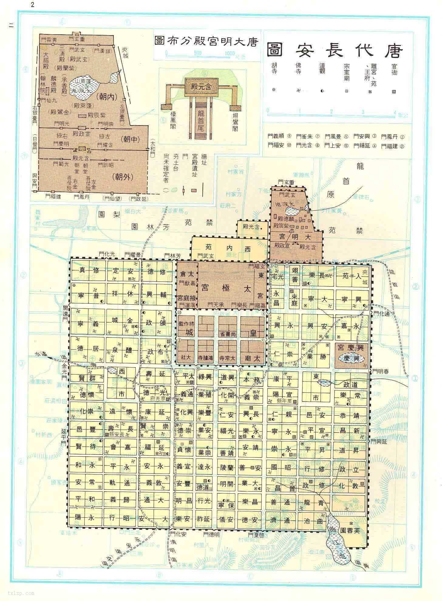
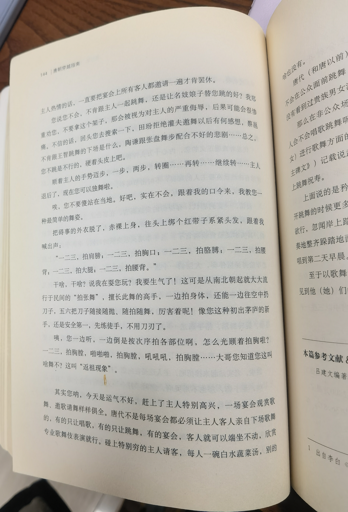

#### 辔[pei，第四声]
西市买鞍鞯，南市买辔头，北市买长鞭。
汉典（https://www.zdic.net/hans/辔) -- 
pei，四声，驾驭牲口的嚼子和缰绳：～头。鞍～。按～徐行。

#### 坟典
三坟：伏羲、神农、黄帝之书
五典：少昊、颛顼、高辛、唐、虞之书
唐代时就已经开始泛指古书，古代典籍的通称。

#### 夜禁制度
长安城横竖三十八条街道，分割为一百多个坊，由坊城和坊墙围起来
人口集中居住在北区（皇宫和官府所在）
夯土：hang，一声

#### 称呼
##### 母
阿娘，娘娘，母亲，皇后，皇后殿下
~~母后，皇后陛下~~
##### 父
阿耶，耶耶，父亲，大人，圣人，主上，陛下
哥哥 -- 好怪，不用
~~皇上，万岁（百姓情绪激动拍马屁用，日常不用），父皇~~
##### 兄
阿兄，大兄，二兄……
##### 官员
姓+官爵
姓+‘公’
##### 男性
郎
丈人，老丈
郎君
小郎君
~~爷（老爷，少爷）~~
##### 女性
娘
阿婆，老妇人
娘子
小娘子
~~小姐~~
##### 称呼比自己地位低下的人
你，汝，尔
对自家奴婢：名字，狗奴，贱婢，~~奴才~~
##### 自称
臣，儿，~~儿臣~~，名字，奴
男性自称：仆，愚，鄙人，下走，某（唐代特色）
女性自称：婢，妾，儿（唐代特色）
对下自称：我，吾

最通用：奴（自称），郎君，娘子

#### 酒文化
##### 白酒，绿蚁酒，浊酒 —— 便宜
白居易 《问刘十九》
绿蚁新醅酒，红泥小火炉。
晚来天欲雪，能饮一杯无？
范仲淹 《渔家傲》
浊酒一杯家万里，燕然未勒归无计。羌管悠悠霜满地。
杨慎 《临江仙》（小说《三国演义》开篇词）
一壶浊酒喜相逢。古今多少事，都付笑谈中。
陶渊明 《饮酒》
虽无挥金事，浊酒聊可恃。
##### 清酒
白居易：“世间好物黄醅酒”
李白 《客中作》：“兰陵美酒郁金香，玉碗盛来琥珀光。”

魏家菜
魏徵酿绿酒：
李世民：“醽醁（发音灵鹿）胜兰生，翠涛过玉薤（xie，四声）。千日醉不醒，十年味不败。“

#### 货币
宋代以前，中国绝大部分地区都不把白银作为流通性货币使用。
金子常见，一两金子大概换6000钱，上下浮动，低可到3500钱，高可至8000钱。
开元通宝
绢：正常价在500文钱

#### 住宅
夯（hang，第一声）：夯土是一类建筑材料。表示红泥、粗砂、石灰块的三合土中的空隙经过夯实的动作之后变得更结实。是土材质中较为结实的建材，在古代是城墙、宫室常用的建材，在中国，最早在龙山文化已能掌握夯土的技术。是客家土楼所呈现的土黄色外观。

鸱（chi，第一声）

北方地面少用木地板，豪门贵族用雕纹花砖铺砌，另一种高级做法是用水磨石平铺。达官贵人们可能会在地面上再铺一层厚厚的宣城红地毯。
白居易《红线毯》：“宣城太守知不知，一丈毯，千两丝，地不知寒人要暖，少夺人衣作地衣。”
得享高官厚禄的宣州太守知道不知道，织就一丈毯，需费千两丝，多么劳民伤财！地不知冷暖，劳苦人民却靠这生存啊，不要再夺走人民赖以织衣保暖的丝去织就地毯了。

#### 名胜
灞桥，是长安的东大门，连接着长安东边的各主要交通干线。
春明门外
早春时节，大风扬起，柳絮漫天飞舞像隆冬飘雪，此即关中八景之一的“灞桥风雪”。
李白《忆秦娥》：“年年柳色，灞陵伤别”
岑参：“初程莫早发，且宿灞桥头”
刘禹锡《请告东归发灞桥却寄诸僚友》：“征徒出灞涘（si，第四声），回首伤如何“
李贺《送秦光禄北征》：”灞水楼船渡，营门细柳开“
李商隐《灞岸》：”灞水桥边倚华表，平时二月有东巡“
李益《途中寄李二》：”杨柳含烟灞岸春，年年攀折为行人。好风若借低枝便，莫遣青丝扫路尘。“

终南山脚下樊川
杜甫《奉陪郑驸马韦曲二首》：“韦曲花无赖，家家恼杀人”
崔护：“人面桃花相映红”

乐游原
李商隐《乐游原》：“向晚意不适，驱车登古原。夕阳无限好，只是近黄昏。”

#### 青楼妓院
都知

罍（lei，第二声）：1.古代一种盛酒的容器。小口，广肩，深腹，圈足，有盖，多用青铜或陶制成。2.盥洗用的器皿。

#### 贵族男子舞蹈文化
拍张舞
一二三，拍肩膀；一二三，拍胸口；一二三，拍胳膊；一二三，拍腰背；一二三，拍大腿；一二三，拍腰背。
在图书馆里看到这段，笑疯了！！

#### 马球
幞头（fu，第二音），唐代戴软角幞头

#### 婚俗
汉代以来，结婚有六礼：“纳采，问名，纳吉，纳征，请期，亲迎”
近现代民间通俗叫法叫：“提亲，合八字，过大帖，送彩礼，算日子，接媳妇”

《催妆诗》
今宵织女降人间，对镜匀妆计已闲；自有夭桃花菡面，不需脂粉污容颜。
两心他自早心知，一过遮阑故作迟；更转只愁奔月兔，情来不要画娥眉。
传闻烛下调红粉，明镜台前别作春；不须满面混妆却，留着双眉待画人。
昔年将去玉京游，第一仙人许状头；今日幸为秦晋会，早教鸾凤下妆楼。

《去扇诗》三首
青春今夜正方新，红叶开时一朵花。
分明宝树从人看，何劳玉扇更来遮。

千重罗扇不须遮，百美娇多见不奢。
侍娘不用相要勒，终归不免属他家。

闺里红颜如舜花，朝来行雨降人家。
自有云衣五色映，不须罗扇百重遮。