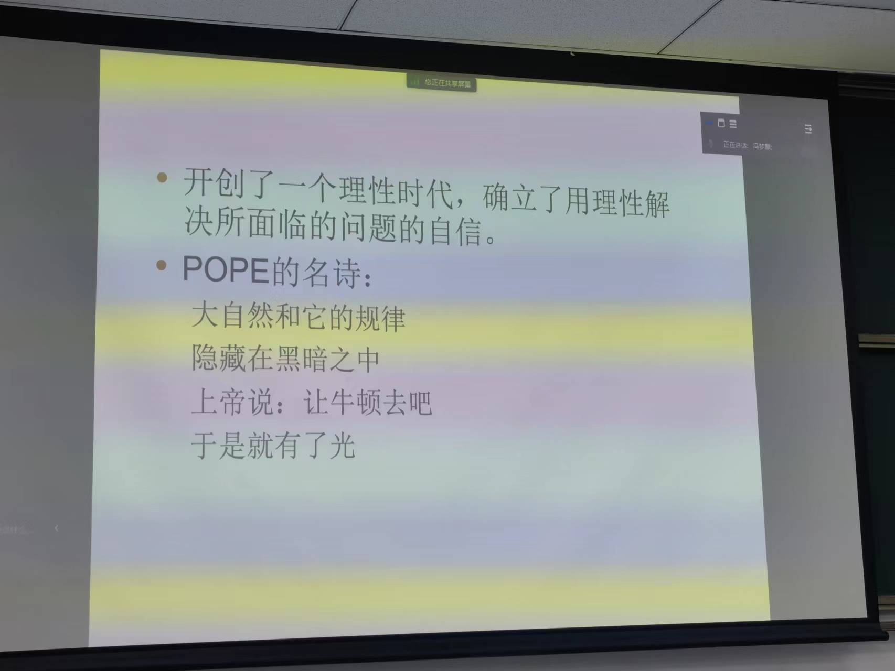

仇恨驱动的引发对他人的同情因而获得支持，从中必定有人获益，当从这个角度考虑时，或许如迎头冷水一般。

人类过得有意义的时间很短暂。现在的人类经历过教育，鼠目寸光者多，少有人意识到主流观点是否有矛盾之处，而只是盲从。

文艺复兴形成了现代科学（甚至包括现代技术）赖以产生与发展的一整套现行观念。
1.人的主体性
基督教认为的人与自然天然就是对立的关系，因为上帝创造人类与自然，但是独立创造。
2.自然的数学化
中国风水认为左右并非相同，笛卡尔坐标系并不适用，这就是一种不可数学化。比如设定温度，将其普遍性使用后，我们很难意识到各种差异性，比如南北差异，干湿差异等等。
如果从诗词用语的角度，我确实不认同这种数学化。
自然的数学化，这要求自然本质是可以数学化的。
3.人类认识自然、征服自然
4.人类世俗生活的先决性

与“天不生仲尼，万古如长夜”有异曲同工之处（笑）。

机械论自然观
如果把整个世界视为一个钟表，这在中国很难解释——谁来拧螺丝等等都是问题，但在西方，上帝可以解决一切，因此，基督教的存在其实对西方世界造成了很大影响。
牛顿提出万有引力，提供了世界万物运行的一种法则。
机械论自然观提供了一幅自然界的存在图景，在这幅图景中，自然界绝对不变，从来如此，并将永远如此。万事万物在时间上并列而没有历史的演化。

形而上学

决定论
躺在床上，发现有件事没做，但是很懒不想起来，决定起不起来是因为我的神经系统我的各个器官决定的结果，甚至能一直追溯到宇宙大爆炸。因此我不起来我没有责任（笑）。
但忽略了人是可以有选择的

牛顿居然是因为无法解释演化的问题所以回归了神学，震惊！但这正是因为当时的认知不足以支撑解释演化的问题，因此似乎又是必然的遗憾（叹气）。