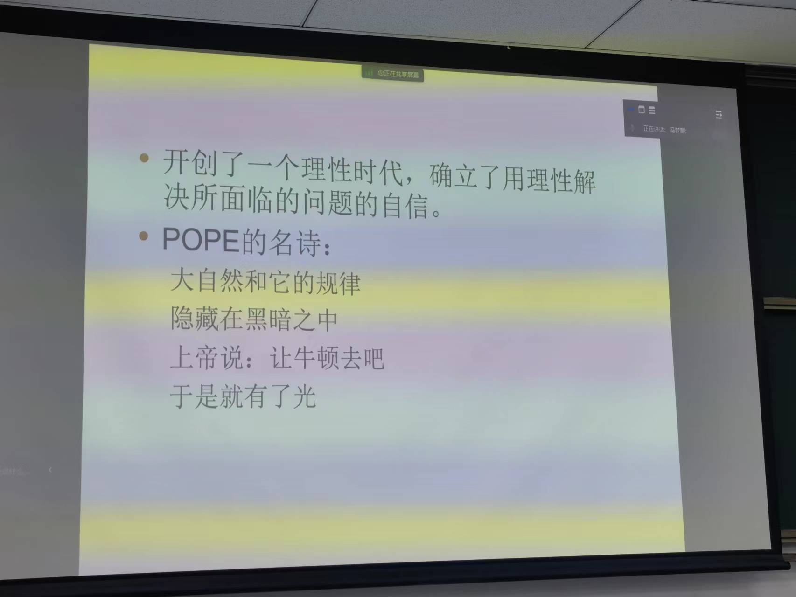

仇恨驱动的引发对他人的同情因而获得支持，从中必定有人获益，当从这个角度考虑时，或许如迎头冷水一般。

人类过得有意义的时间很短暂。现在的人类经历过教育，鼠目寸光者多，少有人意识到主流观点是否有矛盾之处，而只是盲从。

文艺复兴形成了现代科学（甚至包括现代技术）赖以产生与发展的一整套现行观念。
1.人的主体性
基督教认为的人与自然天然就是对立的关系，因为上帝创造人类与自然，但是独立创造。
2.自然的数学化
中国风水认为左右并非相同，笛卡尔坐标系并不适用，这就是一种不可数学化。比如设定温度，将其普遍性使用后，我们很难意识到各种差异性，比如南北差异，干湿差异等等。
如果从诗词用语的角度，我确实不认同这种数学化。
自然的数学化，这要求自然本质是可以数学化的。
3.人类认识自然、征服自然
4.人类世俗生活的先决性

