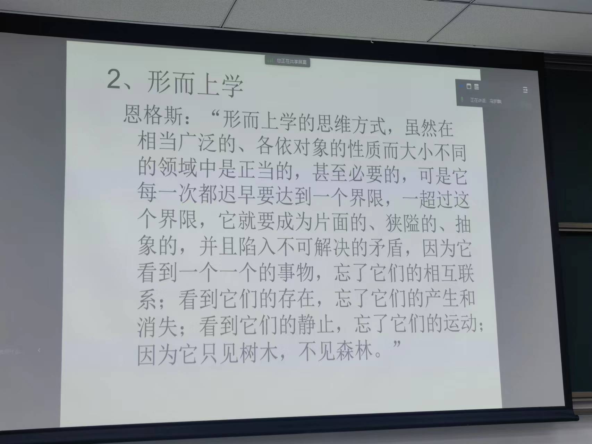

仇恨驱动的引发对他人的同情因而获得支持，从中必定有人获益，当从这个角度考虑时，或许如迎头冷水一般。

人类过得有意义的时间很短暂。现在的人类经历过教育，鼠目寸光者多，少有人意识到主流观点是否有矛盾之处，而只是盲从。

文艺复兴形成了现代科学（甚至包括现代技术）赖以产生与发展的一整套现行观念。
1.人的主体性
基督教认为的人与自然天然就是对立的关系，因为上帝创造人类与自然，但是独立创造。
2.自然的数学化
中国风水认为左右并非相同，笛卡尔坐标系并不适用，这就是一种不可数学化。比如设定温度，将其普遍性使用后，我们很难意识到各种差异性，比如南北差异，干湿差异等等。
如果从诗词用语的角度，我确实不认同这种数学化。
自然的数学化，这要求自然本质是可以数学化的。
3.人类认识自然、征服自然
4.人类世俗生活的先决性

与“天不生仲尼，万古如长夜”有异曲同工之处（笑）。

机械论自然观
如果把整个世界视为一个钟表，这在中国很难解释——谁来拧螺丝等等都是问题，但在西方，上帝可以解决一切，因此，基督教的存在其实对西方世界造成了很大影响。
牛顿提出万有引力，提供了世界万物运行的一种法则。
机械论自然观提供了一幅自然界的存在图景，在这幅图景中，自然界绝对不变，从来如此，并将永远如此。万事万物在时间上并列而没有历史的演化。

形而上学

决定论
躺在床上，发现有件事没做，但是很懒不想起来，决定起不起来是因为我的神经系统我的各个器官决定的结果，甚至能一直追溯到宇宙大爆炸。因此我不起来我没有责任（笑）。
但忽略了人是可以有选择的

牛顿居然是因为无法解释演化的问题所以回归了神学，震惊！但这正是因为当时的认知不足以支撑解释演化的问题，因此似乎又是必然的遗憾（叹气）。

达尔文进化论
达尔文进化论提出之前，生物学家更多地从生物之间的互利共生之类的关系进行研究，但是提出之后，大家似乎更多关注到了竞争的关系，有点像丛林法则，这其实是有点扭曲的。
有人认为，进化论带有种族的歧视，将进化论与人类社会联系在一起，认为进化论代表了一种歧视。
之前严复翻译天演论到中国，大家很快接受了这种观点，但其中有多少人真的懂近代生物学？适者生存的观点让人们联想到现实社会的处境，因此心有戚戚，因此说，进化论的观点运用到人类社会中，也不一定是件坏事。
达尔文进化论暴露出机械自然观和形而上学思维方式的局限性。
我认为是因为达尔文进化论讲出了之前机械自然观所没有讲到的历史的演化。

辩证唯物主义自然观

西方哲学，从古希腊开始，基本都是以唯心主义为主的，唯物主义的科学家是被边缘化的，并且发展水平不高。
马克思和恩格斯构建了历史上最为完整严密的唯物主义哲学体系。

-- 恩格斯《自然辩证法》
为什么越听课，我越觉得乱世出英雄呢？英雄的定义是广泛的，他们是天才，是一切。
西方追求不变量，东方则更接受变化，比如周易，比如道家
“一切有为法，如梦幻泡影，如露亦如电，应作如是观。“
历史的某个阶段会撕裂或分裂，但终将会过去，站在人类历史的角度去看不同文明的存在，会超越暂时的黑暗，从而看到更长远的东西。

看到前面英雄处于乱世的想法，或许是因为乱世需要英雄，所以英雄出现了。和平的年代对英雄的需求变少了，因此或许本能成为英雄的人没有发挥出他的潜力，或者即使做出了在乱世而言英雄的事，但在和平时代算不上英雄。
科学研究的开始或许是一个问题，但是问题大多有时是在研究过程中产生的，就像一个环一样，无法说明什么是绝对的起点。

客观事实：一定时空中存在的客观事件
经验事实：为人类所经验到的客观事实，表现为陈述语句（广义的陈述语句）
科学事实：通过观察所获得的经验事实，是经过科学整理和鉴定的确定事实。
事实经过语言的表达，一定涵盖主观的东西，事实就不是完全客观的事实了。 
教育让思维格式化，任何东西仿佛都有了正确答案。这让我们显得正常。但世界真是如此吗？
我们看小朋友，经常觉得他有很多奇思妙想，或许这才是世界的多样可能，但是在不断成长中，因为社会选择的倾向，没有这么多奇思妙想，循规蹈矩做题等等反而获得了更高的分数，在这种倾向中，生活变得平庸多了。所以世界上有趣的人少了很多，怪不得有趣的人这么受欢迎，因为大多数人不有趣。
观察中渗透着理论，我们在认知世界时，会先有期待，我们很难去怀疑自己的认知框架。除非遇到重大挫折，才会怀疑自己的认知框架是否存在问题。
研究自然是为了人类的幸福服务的。
这个观点我曾经都没有想过。或许我曾经追求的是绝对的理性世界。但是人与自然是不可分割的，绝对理性的世界是不存在的。如果以这种心理进行科学研究，也许我终其一生都难以达到我心中的乌托邦。
要排除科学研究中的主观性，本来就是错误的，科学研究本身就伴随着主观。
对事物的认知有很多方面，从科学的角度，艺术的角度……，每个角度对于认识事物都是必要的，而且是正确的。

有一类观点认为，用感官会刺瞎灵魂的双眼
好东西容易被滥用。比如辩证法容易被用于诡辩。
归纳法
假设世界是均匀分布的。而不是有特定几个名额成立，名额用完后就不成立了。
很有趣的观点。从未想过这种比喻。
类比法
笑死了，老师说，要让别人为难，就会为难自己。（今天作业的内容在还没讲的地方，因此不得不跳过一些东西先讲这一部分）

这正是我的问题！
判决性实验

科学技术的哲学反思与生态文明建设
希腊人追求永恒的意义，而不是一时时髦。
